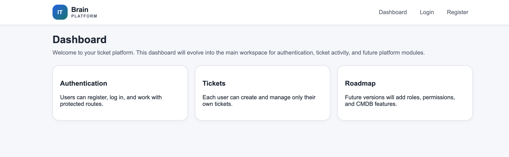
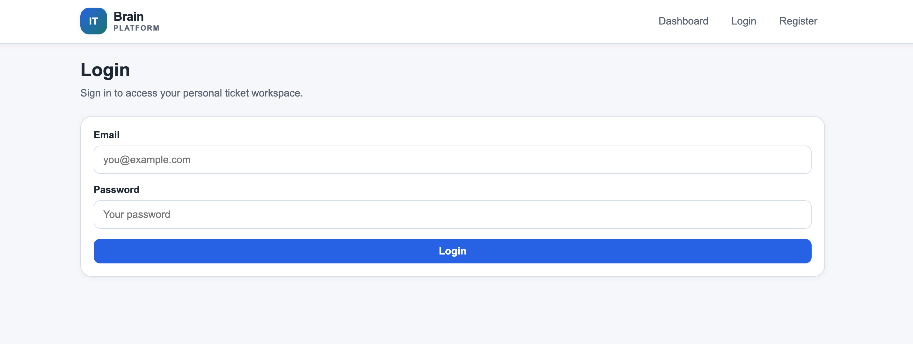
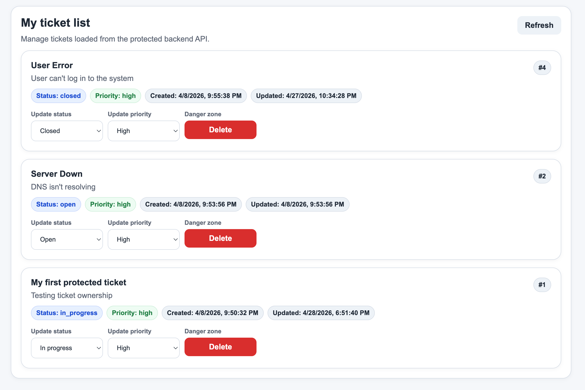
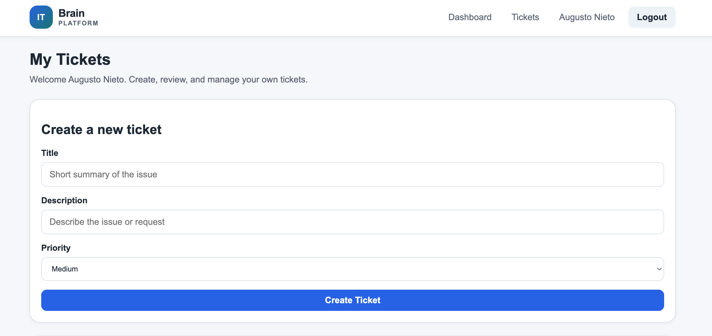
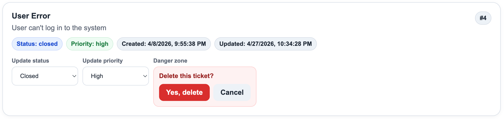

# ITBrain Platform

A full-stack ticket management platform designed to simulate real-world IT operations workflows, built with FastAPI, React, PostgreSQL, and Docker.

## Overview

ITBrain Platform is a modern full-stack application that allows users to create, manage, and track their own tickets in a secure and structured environment.

This project is designed as a portfolio-grade system that demonstrates backend architecture, frontend integration, authentication flows, and containerized development using industry-relevant tools.

The platform is built with scalability in mind, with future plans to expand into role-based access, support team workflows, and CMDB integration.

## Screenshots

### Dashboard



### Login



### Tickets



### Create Ticket



### Delete Confirmation



## Features (v1)

- User registration and authentication (JWT-based)
- Protected routes with frontend and backend validation
- Create, view, update, and delete tickets
- User-specific ticket isolation
- Real-time UI updates after actions
- Responsive design (desktop, tablet, mobile)
- Dockerized backend and PostgreSQL database
- Alembic-based database migrations

## Tech Stack

### Backend

- FastAPI
- SQLAlchemy
- PostgreSQL
- Alembic (migrations)
- Uvicorn

### Frontend

- React (Vite)
- React Router
- Axios

### DevOps / Infrastructure

- Docker
- Docker Compose

### Other

- JWT Authentication
- REST API design

## Architecture

The application follows a clean separation between frontend and backend.

### Backend

- Layered architecture:
  - API routes
  - Services (business logic)
  - Repositories (data access)
  - Models (SQLAlchemy)

### Frontend

- Component-based structure:
  - Pages
  - Reusable UI components
  - API layer
  - Auth context for global state

### Communication

- REST API
- JSON responses
- Bearer token authentication

### Database

- PostgreSQL
- Managed via Alembic migrations

## Getting Started

### Prerequisites

Install in your computer:

- Docker
- Node.js (v18+ recommended)
- npm

### Environment Variables

Before running the project, you must create a `.env` file in the root directory.

You can use the provided example:

```bash
cp .env.example .env
```

Then adjust the values if needed.

Key variables explained

```
- DATABASE_URL
    Connection string used by the backend to connect to PostgreSQL.
- POSTGRES_*
    Used by Docker to configure the database container.
- SECRET_KEY
    Used to sign JWT tokens. Change this in production.
- ACCESS_TOKEN_EXPIRE_MINUTES
    Controls token expiration time.
```

### Clone the repository

```bash
cd <your-project-folder>
git clone https://github.com/augusto607/ticket-platform
```

### Start Backend (Docker)

```bash
docker compose up
```

### How Docker uses the .env file

Docker Compose automatically reads the `.env` file and injects values into:

- the database container

- the backend service

### Backend runs on

<http://localhost:8000>

### Start Frontend

```bash
cd frontend
npm install
npm run dev 
```

### Frontend runs on

<http://localhost:5173>

### Database Migrations

```bash
docker compose exec backend alembic upgrade head
```

---

# Step 8 — API overview

## API Overview

### Authentication

- POST /auth/register
- POST /auth/login
- GET /auth/me

### Tickets

- GET /tickets/
- POST /tickets/
- PUT /tickets/{id}
- DELETE /tickets/{id}

## Project Structure

```code
ticket-platform/
├── backend/
│   ├── app/
│   │   ├── api/
│   │   ├── services/
│   │   ├── repositories/
│   │   ├── models/
│   │   └── core/
│   ├── alembic/
│   └── Dockerfile
├── frontend/
│   ├── src/
│   │   ├── api/
│   │   ├── components/
│   │   ├── pages/
│   │   ├── context/
│   │   └── styles/
├── docker-compose.yml
└── README.md
```

## Roadmap (v2)

Planned improvements:

- Role-based access control (admin, support, user)
- Ticket assignment to support teams (Level 1 / Level 2)
- CMDB integration
- Advanced filtering and search
- Dashboard analytics
- Improved UI/UX and animations
- Deployment to cloud environment

## Author

Built as part of a continuous learning and development journey to transition into a high-level full-stack and DevOps role.

Focus areas:

- Backend architecture
- API design
- Frontend integration
- Docker and environment management
- Real-world system design
